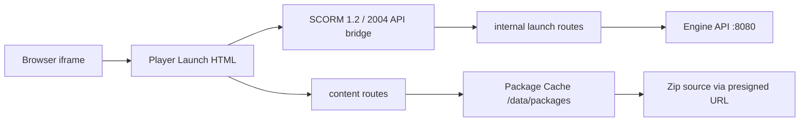
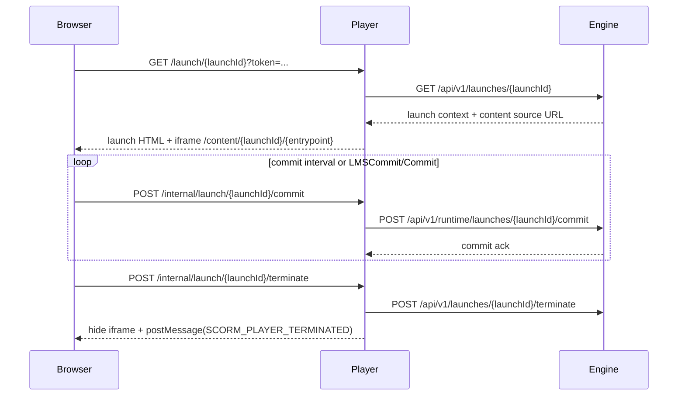

# player

## Scope
Node.js/TypeScript service that hosts launch UI and SCO content:
- fetches launch context from engine
- downloads/extracts package zip into local cache
- serves course entrypoint/content files
- injects SCORM API adapters (`window.API`, `window.API_1484_11`)
- forwards commit/terminate calls to engine runtime endpoints
- emits `SCORM_PLAYER_TERMINATED` message to parent window on session end

## Runtime
- Default HTTP port: `3000`

## Routes
- `GET /health`
- `GET /launch/:launchId?token=...`
- `GET /content/:launchId/*`
- `POST /internal/launch/:launchId/commit?token=...`
- `POST /internal/launch/:launchId/terminate?token=...`

## Architecture


## Design Patterns
- `Command Handler`: render launch / commit / terminate write flows are delegated to dedicated handlers.
- `State`: launch session lifecycle (`ACTIVE -> TERMINATING -> TERMINATED`) is centralized in `LaunchSessionService`.
- `Builder`: launch page model composition is handled by `LaunchPageViewModelBuilder`.
- `Decorator`: `ObservedEngineClient` wraps engine calls with operation-level observability logs.

## Request Flow (Launch to Terminate)


## Parent Window Event
```js
window.addEventListener("message", (event) => {
  if (event.data?.type === "SCORM_PLAYER_TERMINATED") {
    // redirect or update LMS UI
  }
});
```

## Build
```bash
docker build -t scorm-player:local .
```

## Run with Full Stack
```bash
cd ../central-docker-infrastructure/infrastructure
docker compose up --build
```
